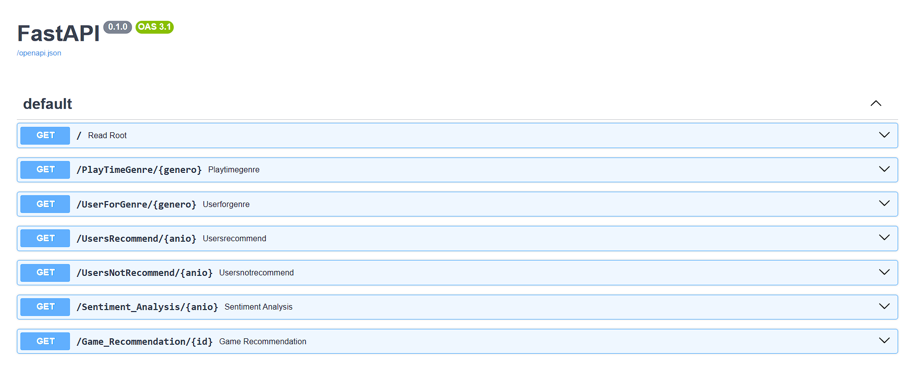

# <h1 align=center> MLops Project - HENRY DATA SCIENCE <h/>

## <h2 align=center> Game Recommendation System <h/>

### <h3 align=center> By Angel Bello Merlo <h/>

## Topic

You started working as **`Data Scientist`** in Steam. The world is beautiful and you are going to create your first ML model that solves a business problem: Steam asks a game recommendation system for users

You go to their data and you realize that their maturity is low. Nested data, without transformation, there are no automated processes for updating new movies or series, among other things(making your job impossible).

## ETL process

Extract, Transform and load process was carried out following these steps.

Original Dataset:
[Original Dataset ](https://github.com/Abyzou1995/PI1_ML_PT07/tree/main/Dataset/Original_Dataset)

### Feature Engineering

The user_reviews dataset includes reviews of games made by different users. You must create the 'sentiment_analysis' column by applying sentiment analysis with NLP with the following scale: it must take the value '0' if it is bad, '1' if it is neutral and '2' if it is positive. This new column should replace user_reviews.review to make the work of machine learning models and data analysis easier. If this analysis is not possible due to the absence of the written review, it should take the value of 1.

This process can be seen there:
[ETL MLops Game Recommendation System ](https://github.com/Abyzou1995/PI1_ML_PT07/blob/main/ETL_Sentiment.ipynb)
Dataset after ETL:
[ETL Dataset ](https://github.com/Abyzou1995/PI1_ML_PT07/tree/main/Dataset/Function_Dataset)

## EDA

Exploratory Data Analysis was carried out following these steps.

- Cleaning datased done.
- Use libraries like pandas_profiling, missingno, pandas, matplotlib.
- Investigate the relationships between the variables of the datasets.
- The EDA should include interesting graphs to extract data, such as a word cloud with the most frequent words in movie titles.
- Check if there are outliers or anomalies.
 

This process can be seen there:
[EDA MLops Game Recommendation System ](https://github.com/Abyzou1995/PI1_ML_PT07/blob/main/EDA_MLops.ipynb)
Dataset after EDA:
[EDA Dataset ](https://github.com/Abyzou1995/PI1_ML_PT07/tree/main/Dataset/Function_Dataset)

## Functions for the API Development

Six functions for the endpoints that will be consumed in the API.
Dataset for functions:
[Function Datasets](https://github.com/Abyzou1995/PI1_ML_PT07/tree/main/Dataset/Function_Dataset)

1. def PlayTimeGenre(genre: str): Should return year with the most hours played for that genre.
2. def UserForGenre(genre: str): Should return the user who accumulates the most hours played for the given genre and a list of the accumulation of hours played per year.
3. def UsersRecommend( year : int ): Returns the top 3 MOST recommended games by users for the given year. (reviews.recommend = True and positive/neutral comments)
4. def UsersNotRecommend( year : int ): Returns the top 3 games LEAST recommended by users for the given year. (reviews.recommend = False and negative comments)
5. def sentiment_analysis( year : int ): Depending on the release year, a list is returned with the number of user review records that are categorized with a sentiment analysis.

This process can be seen there:
[Functions API MLops Movie Recommendation System ](https://github.com/Abyzou1995/PI1_ML_PT07/blob/main/Funciones.ipynb)

## Function ML Game Recommendation System for the API Development

- This consists of recommending games to users based on similar games, so the score similarity between that game and the rest of the games must be found, they will be ordered according to the similarity score and it will return a list with 5 values

Based on research articules, features and ML text-analysis model were chosen.

- def game_recommendation (product id): By entering the product id, we should receive a list with 5 recommended games similar to the one entered.

1. Features: genres, specs, names(sample based on sentiment analysis positive due to an excesive computational cost if whole dataset is used).
2. TF-IDF (Term Frequency–Inverse Document Frequency) for Natural Language Proccesing ML model using Scikit-learn.

This process can be seen there:
[Model MLops Movie Recommendation System ](https://github.com/Abyzou1995/PI1_ML_PT07/blob/main/ML.ipynb)

## Deployment

- Making the company data available using the FastAPI framework.
- Render is an unified cloud to build and run all your apps and websites.

Deployed API code can be seen there:
[Code API Movie Recommendation System ](https://github.com/Abyzou1995/PI1_ML_PT07/blob/main/main.py)

Deployed API can be seen there:
[Render API Movie Recommendation System ](https://pi1-ml-pt07.onrender.com/docs)

## Video Tutorial

This video can be seen there:
[MLops Movie Recommendation System ](https://www.youtube.com/watch?v=I5aDsbqEHwg)
